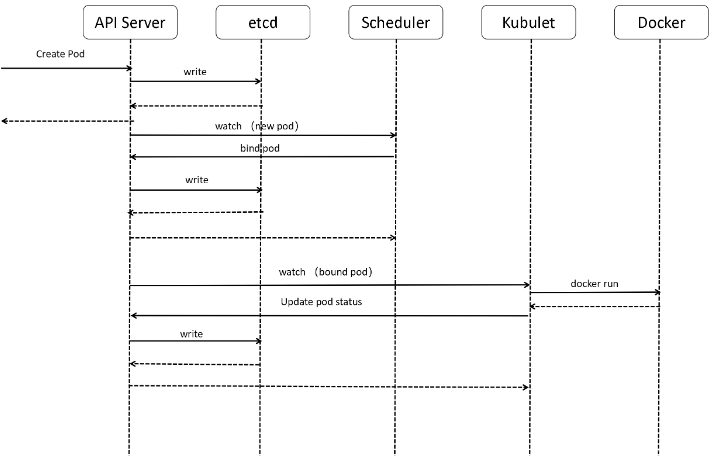

## kube-apiserver

### 1. pod的创建流程
(1)使用kubectl工具想Kubernetes API Server发送创建pod的请求  
(2)Kubernetes API Server接收到请求后，将其持久化到ETCD集群中  
(3)Kubernetes API Server基于Watch机制通知给Scheduler  
(4)Scheduler根据预选和优选调度算法为Pod资源对象选择最优的节点并通知Kubernetes API Server  
(5)Kubernetes API Server接收到Scheduler的通知后，将Pod资源对象持久化到ETCD集群中  
(6)Kubernetes API Server通知最优节点上的kubelet组件  
(7)kubelet组件接收到Kubernetes API Server的通知后，通过Docker API在节点上创建Pod容器  
(8)kubelet组件将容器状态上报给Kubernetes API Server  
(9)Kubernetes API Server接收到kubelet组件的上报后，将Pod资源对象的状态持久化到ETCD集群中  
(10)Kubernetes API Server 将确认信息返回给kubelet组件  

